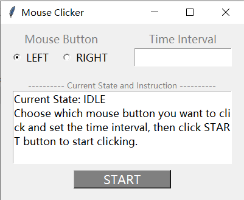

## 简易鼠标连点器

**代码介绍见[我的Blog](https://komorebi660.github.io/2021/09/04/MouseClick/)**

**注意：本代码在`Linux`环境运行出现异常，目前暂不清楚原因，在`Windows10`下运行正常**

### 安装依赖库

安装代码所需库：

```
pip install pynput
```

`threading`、`time`、`tkinter`库为`Python`自带库，无需手动安装。

Linux环境可能没有安装`tkinter`库，输入：

```
sudo apt-get install python-tk
或
sudo apt-get install python3-tk
```

安装`tkinter`

### 使用示例

直接运行代码:



在上述GUI界面中设置点击鼠标左键或右键(`Mouse Button`)、点击时间间隔(`Time Interval`)，然后点击`START`开始监听，通过`F8`来控制连点的开始与结束，通过`ESC`来控制监听的结束。

在`Windows`环境下，你还可以将其打包为`.exe`文件，这样即使电脑不含`Python`也能运行，方法如下：

安装`pyinstaller`:

```
pip install pyinstaller
```

由于版本兼容问题，需要将pynput降级至1.6.8:

```
pip install pynput==1.6.8
```

然后在源码所在目录执行：

```
pyinstaller -F -w MouseClick.py
```

即可生成`.exe`文件，位于`/dist`目录下